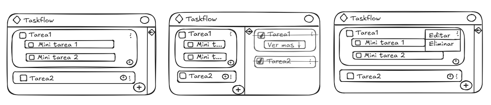

# 🧾 TaskFlow

## 📌 Descripción:

    Aplicación web para gestionar tareas, permitiendo crear, editar, eliminar y marcar tareas como completadas. Además, permite organizar subtareas dentro de cada tarea principal.

## ⚙️ Funcionalidades

    🔹 Básicas
        Crear tareas
        Editar tareas
        Eliminar tareas
        Marcar tareas como completadas
        Visualizar lista de tareas

    🔹 Avanzadas
        Agregar subtareas a cada tarea
        Guardar datos en el navegador (LocalStorage)
        Filtrar tareas (completadas / pendientes)

## 🧠 Modelo de datos 

    📌 Tarea
        id
        nombre
        detalles
        estado (completada o no)
        subtareas (lista)

    📌 Subtarea
        id
        nombre
        detalles
        estado

## 🔄 Flujo de usuario

    Usuario escribe una tarea
    Hace clic en “Agregar”
    La tarea aparece en la lista
    Puede:
    Marcar como completada
    Editar
    Eliminar
    Agregar subtareas

## 🎨 Diseño UI

